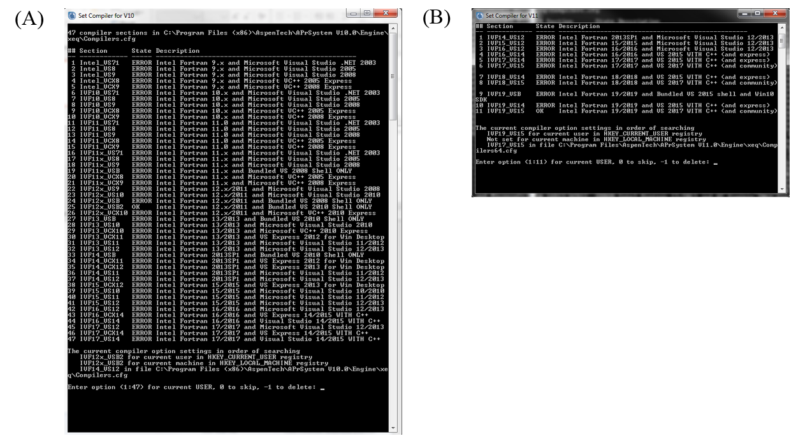

User Manual

Version 3.2.1

March 2022

Table of Contents
=================

`1.0 Reporting Issues 3 <#_Toc433811326>`__

`2.0 Version Log 3 <#_Toc43479066>`__

`MEA Steady State Model 4 <#_Toc43479067>`__

`1.0 Model Development 4 <#_Toc43479068>`__

`1.1 Model Background 4 <#_Toc432599739>`__

`1.2 Physical Property Models 4 <#_Toc432599740>`__

`1.3 Mass Transfer and Hydraulic Models 6 <#_Toc432599741>`__

`1.4 Development of Process Model 6 <#_Toc432599742>`__

`1.5 Model Features 7 <#_Toc43479073>`__

`2.0 Tutorial 8 <#_Toc432599743>`__

`2.1 Creating Fortran Subroutines 8 <#_Toc43479075>`__

`2.1.1 Viscosity Model 8 <#_Toc43479076>`__

`2.1.2 Molar Volume Model 10 <#_Toc43479077>`__

`2.1.3 Surface Tension Model 11 <#_Toc43479078>`__

`2.1.4 Liquid Diffusivity Model 13 <#_Toc43479079>`__

`2.1.5 Reaction Kinetics Model 14 <#_Toc43479080>`__

`2.1.6 Mass Transfer Model 17 <#_Toc43479081>`__

`2.1.7 Interfacial Area Model 18 <#_Toc43479082>`__

`2.1.8 Holdup Model 18 <#_Toc43479083>`__

`2.1.9 Creation of dll and opt files 18 <#_Toc43479084>`__

`2.2 Predicting System VLE 19 <#_Toc432599744>`__

`2.3 CO\ 2 Capture Process Simulation Base Case Setup
21 <#_Toc432599745>`__

`2.4 CO\ 2 Capture Process Simulation Example 22 <#_Toc432599746>`__

`3.0 Usage Information 25 <#_Toc43479088>`__

`3.1 Environment/Prerequisites 25 <#_Toc432599748>`__

`3.2 Support 25 <#_Toc43479090>`__

`4.0 References 25 <#_Toc432599750>`__

List of Figures
===============

`Figure 1: ‘Set Compiler’ applications for (A) Aspen Plus\ ® V10 and (B)
Aspen Plus\ ® V11 8 <#_Toc62827847>`__

`Figure 2: CO\ 2 partial pressure as a function of loading and
temperature (30 wt% MEA). 20 <#_Toc432596348>`__

`Figure 3: Results of the “FLOW” sensitivity block for the case study.
23 <#_Toc432596350>`__

`Figure 4: Absorber temperature profile for the case study.
24 <#_Toc432596351>`__

`Figure 5: Regenerator temperature profile for the case study.
24 <#_Toc432596352>`__

List of Tables
==============

`Table 1: Suggested Ranges for Variables in Simulation
7 <#_Toc17132417>`__

`Table 2: Results of PCO\ 2 Sensitivity Block 20 <#_Toc17132418>`__

`Table 3: Variables for Base Case Simulation 21 <#_Toc17132419>`__

`Table 4: Selected Stream Table Results 22 <#_Toc17132420>`__

| To obtain support for the products within this package, please send an
  e-mail to
| ccsi-support@acceleratecarboncapture.org.

1. Reporting Issues

To report a problem, make a suggestion or ask a question, please either
open an issue at our GitHub repository at:
https://github.com/CCSI-Toolset/MEA_ssm/issues or alternatively send an
e-mail to our support list: ccsi-support@acceleratecarboncapture.org.

2. Version Log

+----------------+----------------+--------------+----------------+
| Product        | Version Number | Release Date | Description    |
+================+================+==============+================+
| Steady State   | 3.2.1          | 3/31/2022    | Minor updates  |
| MEA Model      |                |              | to             |
|                |                |              | documentation, |
|                |                |              | including      |
|                |                |              | confirmation   |
|                |                |              | that model is  |
|                |                |              | compatible     |
|                |                |              | with Aspen     |
|                |                |              | Plus V12.      |
+----------------+----------------+--------------+----------------+
| Steady State   | 3.2.0          | 2/5/2021     | Addition of a  |
| MEA Model      |                |              | dynamic link   |
|                |                |              | library        |
|                |                |              | containing     |
|                |                |              | compiled       |
|                |                |              | Fortran code   |
|                |                |              | for            |
|                |                |              | compatibility  |
|                |                |              | with Aspen     |
|                |                |              | Plus V11.      |
+----------------+----------------+--------------+----------------+
| Steady State   | 3.1.0          | 7/31/2020    | Inclusion of   |
| MEA Model      |                |              | additional     |
|                |                |              | user Fortran   |
|                |                |              | subroutine for |
|                |                |              | mass transfer  |
|                |                |              | model in order |
|                |                |              | to fix bug     |
|                |                |              | that is        |
|                |                |              | present when   |
|                |                |              | using in-built |
|                |                |              | correlation    |
|                |                |              | for mass       |
|                |                |              | transfer in    |
|                |                |              | conjunction    |
|                |                |              | with user      |
|                |                |              | subroutine for |
|                |                |              | interfacial    |
|                |                |              | area.          |
+----------------+----------------+--------------+----------------+
| Steady State   | 3.0.0          | 8/31/2019    | New version of |
| MEA Model      |                |              | model created  |
|                |                |              | for            |
|                |                |              | compatibility  |
|                |                |              | with Aspen     |
|                |                |              | Plus V10.      |
|                |                |              | Additional new |
|                |                |              | features       |
|                |                |              | include a more |
|                |                |              | rigorous       |
|                |                |              | flowsheet and  |
|                |                |              | instructions   |
|                |                |              | for creating   |
|                |                |              | FORTRAN user   |
|                |                |              | subroutines    |
|                |                |              | needed for the |
|                |                |              | model.         |
+----------------+----------------+--------------+----------------+
| Steady State   | 2.0.0          | 3/31/2018    | Initial Open   |
| MEA Model      |                |              | Source release |
+----------------+----------------+--------------+----------------+
| Steady State   | 2015.10.0      | 10/16/2015   |                |
| MEA Model      |                |              |                |
+----------------+----------------+--------------+----------------+

MEA Steady State Model

1. Model Development

   1. Model Background

This document describes a solvent-based CO\ :sub:`2` capture system
using aqueous monoethanolamine (MEA). The model consists of the
“CCSI_MEAModel.bkp” file with supporting files “ccsi.opt”, “ccsi10.dll”,
and “ccsi11.dll”. The dll files are not provided in the ‘MEA_ssm’
repository, but are available on the release page for the product
(*https://github.com/CCSI-Toolset/MEA_ssm/releases/tag/3.2.0*).The dll
files contain compiled FORTRAN code associated with user subroutines
called in the bkp file; separate versions of the dll have been developed
for compatibility with Aspen Plus\ :sup:`®` V10 and V11. This is due to
a change starting with V11 in which Aspen Plus is compiled as a 64-bit
program, and the associated user subroutines must be compiled as 64-bit
code. The opt file is used to specify the dll file within the bkp file.
**Note: When executing the “CCSI_MEAModel.bkp” file in Aspen V11, the
text in the “ccsi.opt” file must be modified to ‘ccsi11.dll’**. It has
been confirmed that the model is also functional in Aspen V12 if the
‘ccsi11.dll’ is used, and it is expected to be also be compatible with
later versions (e.g., V12.1, V12.2) that have not yet been evaluated by
the authors.

This model represents the first version of the “gold standard” model for
the MEA capture system. It is composed of individually developed
submodels for physical properties of CO\ :sub:`2`-loaded aqueous MEA
solutions and hydraulic and mass transfer models for the system of
interest. Each submodel is developed and calibrated with relevant data
over the full range of process conditions of interest (e.g.,
temperature, composition). For each submodel, existing models are
considered as candidates and are modified to better fit experimental
data over the conditions of interest.

2. Physical Property Models

| Physical property models developed in this work include standalone
  models and an integrated thermodynamic framework. Standalone models
  for viscosity, density, and surface tension of the system have been
  developed, with uncertainty quantification, as described in Morgan et
  al.,\ :sup:`1` and are implemented as FORTRAN user models. The
  thermodynamic framework of this system is developed using UT Austin’s
  Phoenix model\ :sup:`2` thermodynamic framework as a precursor. Here,
  the solution thermodynamics are represented by the ELECNRTL method in
  Aspen Plus, which uses the Redlich-Kwong equation of state to
  calculate the vapor phase fugacity coefficients and the electrolyte
  non-random two liquid
| (e-NRTL) model to calculate the activity coefficients in the liquid
  phase. Model parameters are calibrated by fitting data for VLE, heat
  capacity, and heat of absorption for the ternary
  MEA-H\ :sub:`2`\ O-CO\ :sub:`2` system and VLE data for the binary
  MEA-H\ :sub:`2`\ O system. The kinetic model used in this work is
  taken from the Phoenix model, in which the overall ionic speciation of
  the system is simplified into two equilibrium reactions:

.. math:: 2MEA + \text{CO}_{2} \leftrightarrow \text{MEA}^{+} + \text{MEACOO}^{-}

.. math:: MEA + \text{CO}_{2} + H_{2}O \leftrightarrow \text{MEA}^{+} + \text{HCO}_{3}^{-}

The forward reaction rate constants are taken from the Phoenix model,
and the overall reaction rate is written in terms of the equilibrium
constants which are also calculated as part of the thermodynamic
framework of the system. This follows the methodology presented in
Mathias and Gilmartin\ :sup:`3`, and is implemented to ensure that the
reaction kinetics are consistent with the thermodynamic framework.

3. Mass Transfer and Hydraulic Models

The hydrodynamic models developed in this work include models for
pressure drop and hold-up. The Billet and Schultes\ :sup:`4` correlation
is regressed with data from Tsai\ :sup:`5` for MellapakPlus\ :sup:`™`
250Y packing, which is similar to MellapakPlus 252Y packing, which is
considered in this work. In this work, a novel and integrated
methodology to obtain the mass transfer model is proposed. In this
integrated mass transfer model, parameters of the interfacial area, mass
transfer coefficients, and diffusivity models are regressed using wetted
wall column data from Dugas\ :sup:`6` and pilot plant data from Tobiesen
et al.\ :sup:`7` This required simultaneous regression of process model
and property parameters, which was accomplished using the CCSI software
Framework for Optimization and Quantification of Uncertainty and
Sensitivity (FOQUS).

4. Development of Process Model

The aforementioned submodels are integrated into this steady state
process model, which is representative of the configuration of the
National Carbon Capture Center (NCCC) in Wilsonville, Alabama, for which
data have been obtained for validation of this model. No parameters are
tuned to improve the fit to the fit to the pilot plant data. The model
includes both the absorber and stripper columns, although the recycle of
the lean solvent from the regenerator outlet to the absorber inlet is
not modeled. The columns are modeled as rate based columns using
RateSep\ :sup:`™`.

The various submodels are implemented in Aspen Plus either as built-in
models (e.g., ELECNRTL thermodynamic framework) or FORTRAN user models,
in cases where built-in models with the appropriate model form are not
available. The user models are combined into a dynamic library
(“ccsi10.dll” or “ccsi11.dll” for this model) and a dynamic linking
options (DLOPT) file (“ccsi.opt”) is also provided, which has already
been specified in the Aspen Plus file for this model. The various user
models contained in the linked library include physical property models
for viscosity, density, surface tension, and diffusivity, the hydraulics
model, the interfacial area model, and the reaction kinetics model.

5. Model Features

The “CCSI_MEAModel.bkp” file included is representative of a typical
operating case at NCCC and some adjustment of operating variables is
possible. Table 1 includes some of these variables and suggested ranges
for which the model is expected to work, based on the ranges considered
in the testing at NCCC.

Table : Suggested Ranges for Variables in Simulation

+------------------------------------------------------+--------------+
| Variable                                             | Range        |
+======================================================+==============+
| Lean Solvent Amine Concentration (g MEA/g            | 0.25 – 0.35  |
| MEA+H\ :sub:`2`\ O)                                  |              |
+------------------------------------------------------+--------------+
| Lean Solvent CO\ :sub:`2` Loading (mol               | 0.05 – 0.50  |
| CO\ :sub:`2`/mol MEA)                                |              |
+------------------------------------------------------+--------------+
| Lean Solvent Flowrate (kg/hr)                        | 3000 – 12000 |
+------------------------------------------------------+--------------+
| Flue Gas Flowrate (kg/hr)                            | 1250 – 3000  |
+------------------------------------------------------+--------------+
| Regenerator Reboiler Duty (kW)                       | 150 – 700    |
+------------------------------------------------------+--------------+

Table 1 includes the major variables that dictate the performance of the
process, although the list is not exhaustive. Other variables, including
operating temperature and pressure of the equipment, are set at typical
values for the MEA-based CO\ :sub:`2` capture process, and slight
variation of these variables is allowable. As the lean solvent flowrate
is decreased, the intercooler flow rates should be adjusted accordingly.
**Note:** The apparent mole fractions of molecular species may be
calculated from the amine concentration (γ) and CO\ :sub:`2` loading (α)
using the equations:

.. math::
   X_{\text{MEA}} = \left( 1 + \alpha + \left( \frac{\text{MW}_{\text{MEA}}}
   {\text{MW}_{H_{2}O}}\right)\left( \frac{1}{\gamma} - 1 \right) \right)^{- 1}

.. math::
   X_{\text{CO}_{2}} = \alpha X_{\text{MEA}}

.. math::
   X_{H_{2}O} = 1 - X_{\text{MEA}} - X_{\text{CO}_{2}}

3. Tutorial

   1. Creating Fortran Subroutines

This is an optional tutorial for those users who wish to directly
develop the Fortran subroutines used in this model and compile them as a
dll file. Otherwise, the user may use the provided ‘ccsi.opt’ and
‘ccsi10.dll’/’ccsi11.dll’ files and skip to the tutorial in section 2.2.
In order to create the dll file, ensure that an Intel Fortran compiler
and Microsoft Visual Studio are installed in the machine. Open the Aspen
application “Set Compiler for V10” or “Set Compiler for V11” to see the
list of combinations compatible with V10 and V11, respectively; this is
shown for both versions in Figure 1.

Figure 1: ‘Set Compiler’ applications for (A) Aspen Plus\ :sup:`®` V10
and (B) Aspen Plus\ :sup:`®` V11

As directed in the set compiler application, select an option for which
the ‘State’ is ‘OK’. The provided dll files “ccsi10.dll” and
“ccsi11.dll” were compiled with the respective Fortran compilers shown
with the ‘OK’ status in Figure 1. If all options are shown with the
‘ERROR’ status, then one cannot proceed with the following steps until
the appropriate software is installed.

To obtain FORTRAN template *.f* files distributed with Aspen Tech
software, navigate to one of the following folders depending on the
Aspen version of interest:

*C:\Program Files (x86)\AspenTech\Aspen Plus V10.0\Engine\User*

*C:\Program Files\AspenTech\Aspen Plus V11.0\Engine\User*

For other versions of AspenTech software, the template files may be
found in the folder corresponding to the specific version. The user is
now required to make changes to the template files as directed in the
subsections.

1. Viscosity Model

For the liquid viscosity model, open the file (*mul2u2.f*). In the
section of the code titled ‘DECLARE ARGUMENTS’, add the following code
for declaring additional defined variables that are not included in the
template. The existing code in this section of the template should not
be deleted, as it is needed to declare the major input and output
variables of the subroutine.

INTEGER DMS_KCCIDC,I

INTEGER IH2O,IMEA,IMEACOO,ICO2,IMEAH,IHCO3

REAL*8 XX(100),SUM,DSUM,DPSUM

REAL*8 A,B,C,D,E,F,G

REAL*8 MUW,XCO2T,XMEAT,XH2OT,LDG,WTMEA,MUBLEND

In the ‘BEGIN EXECUTABLE CODE’ section, remove the template code that
has been provided. Note that the final section of the template code, in
which defines the final liquid viscosity (MUMX), its temperature
derivative (DMUMX), and its pressure derivative (DPMUMX), must not be
deleted. Insert the following code under the ‘BEGIN EXECUTABLE CODE’:

IH2O = DMS_KCCIDC('H2O')

IMEA = DMS_KCCIDC('MEA')

IMEACOO = DMS_KCCIDC('MEACOO-')

ICO2 = DMS_KCCIDC('CO2')

IMEAH = DMS_KCCIDC('MEA+')

IHCO3 = DMS_KCCIDC('HCO3-')

DO I=1,100

XX(I) = 0

END DO

DO I=1,N

IF (IDX(I). EQ. IH2O) XX(IH2O) = Z(I)

IF (IDX(I). EQ. IMEA) XX(IMEA) = Z(I)

IF (IDX(I). EQ. IMEACOO) XX(IMEACOO) = Z(I)

IF (IDX(I). EQ. ICO2) XX(ICO2) = Z(I)

IF (IDX(I). EQ. IMEAH) XX(IMEAH) =Z(I)

IF (IDX(I). EQ. IHCO3) XX(IHCO3) = Z(I)

END DO

A = MULU2A(1,IMEA)

B = MULU2A(2,IMEA)

C = MULU2A(3,IMEA)

D = MULU2A(4,IMEA)

E = MULU2A(5,IMEA)

F = MULU2A(1,IH2O)

G = MULU2A(2,IH2O)

MUW = 1.002

MUW=MUW*10**(1.3272*(293.15-T-0.001053*(T-293.15)**2)/(T-168.15))

XCO2T = XX(IMEACOO) + XX(IHCO3) + XX(ICO2)

XMEAT = XX(IMEACOO) + XX(IMEAH) + XX(IMEA)

XH2OT = XX(IHCO3) + XX(IH2O)

LDG = XCO2T/XMEAT

WTMEA = XMEAT*XMW(IMEA) + XH2OT*XMW(IH2O)

WTMEA = 100*((XMEAT*XMW(IMEA))/WTMEA)

MUBLEND=(A*WTMEA+B)*T+(C*WTMEA+D)

MUBLEND=MUBLEND*(LDG*(E*WTMEA+F*T+G)+1)*WTMEA

MUBLEND=DEXP(MUBLEND/T**2)

IF (XMEAT.EQ.0) THEN

SUM=MUI(IH2O)

ELSE IF (XH2OT.EQ.0) THEN

SUM=DEXP(-102.07+7992.1/T+13.724*LOG(T))/1000

ELSE

SUM=MUBLEND*MUW/1000

END IF

The existing RETURN & END statements at the end of the code must be
retained. Ensure that the inserted code lines do not get commented.

2. Molar Volume Model

For the liquid molar volume model, the process is analogous to that used
for the viscosity model. In the folder that contains the Fortran
templates, select ‘\ *vl2u2.f*\ ’. The following code should be added to
the ‘DECLARE ARGUMENTS’ section without deleting the existing code:

INTEGER DMS_KCCIDC,I

INTEGER IH2O,IMEA,IMEACOO,ICO2,IMEAH,IHCO3

REAL*8 XX(100),SUM,DSUM,DPSUM

REAL*8 A,B,C,D,E

REAL*8 AM,BM,CM,AW,BW,CW

REAL*8 VH2O,VMEA

REAL*8 XCO2T,XMEAT,XH2OT,XTOT

REAL*8 XCO2,XMEA,XH2O

In the section marked ‘BEGIN EXECUTABLE CODE’, remove the template code
and replace with the code given below. Note that the final section of
the template code, in which defines the final liquid molar volume (VMX),
its temperature derivative (DVMX), and its pressure derivative (DPVMX),
must not be deleted.

IH2O = DMS_KCCIDC('H2O')

IMEACOO = DMS_KCCIDC('MEACOO-')

ICO2 = DMS_KCCIDC('CO2')

IMEAH = DMS_KCCIDC('MEA+')

IHCO3 = DMS_KCCIDC('HCO3-')

IMEA = DMS_KCCIDC('MEA')

DO I=1,100

XX(I) = 0

END DO

DO I=1,N

IF (IDX(I). EQ. IH2O) XX(IH2O) = Z(I)

IF (IDX(I). EQ. IMEA) XX(IMEA) = Z(I)

IF (IDX(I). EQ. IMEACOO) XX(IMEACOO) = Z(I)

IF (IDX(I). EQ. ICO2) XX(ICO2) = Z(I)

IF (IDX(I). EQ. IMEAH) XX(IMEAH) =Z(I)

IF (IDX(I). EQ. IHCO3) XX(IHCO3) = Z(I)

END DO

A = VL2U2A(1,IMEA)

B = VL2U2A(2,IMEA)

C = VL2U2A(3,IMEA)

D = VL2U2A(4,IMEA)

E = VL2U2A(5,IMEA)

AM=-0.000000535162

BM=-0.000451417

CM=1.19451

AW=-0.00000324839

BW=0.00165311

CW=0.793041

VH2O = XMW(IH2O)/(AW*T**2+BW*T+CW)

VMEA = XMW(IMEA)/(AM*T**2+BM*T+CM)

XCO2T = XX(IMEACOO) + XX(IHCO3) + XX(ICO2)

XMEAT = XX(IMEACOO) + XX(IMEAH) + XX(IMEA)

XH2OT = XX(IHCO3) + XX(IH2O)

XTOT = XCO2T+XMEAT+XH2OT

XCO2 = XCO2T/XTOT

XMEA = XMEAT/XTOT

XH2O = XH2OT/XTOT

SUM = XMEA*VMEA + XH2O*VH2O + XCO2*A + XMEA*XH2O*(B+C*XMEA)

SUM = SUM+XMEA*XCO2*(D+E*XMEA)

IF (XMEA.EQ.0) THEN

SUM=VI(IH2O)

ELSE IF (XH2O.EQ.0) THEN

SUM=VMEA/1000

ELSE

SUM=SUM/1000

END IF

DSUM=0D0

DPSUM=0D0

The existing RETURN & END statements at the end of the code must be
retained.

3. Surface Tension Model

The process for creating the surface tension model is very similar to
the process used for the viscosity and molar volume models. In the
folder containing the Fortran templates, select ‘\ *sig2u2.f*\ ’. The
following code should be added to the ‘DECLARE ARGUMENTS’ section
without deleting the existing code:

INTEGER DMS_KCCIDC,I

INTEGER IH2O,IMEA,IMEACOO,ICO2,IMEAH,IHCO3

REAL*8 XX(100),SUM,DSUM,DPSUM

REAL*8 A,B,C,D,E,F,G,H,K,J

REAL*8 S1,S2,S3,S4,S5,S6

REAL*8 C1W,C1M,C2W,C2M,C3W,C3M,C4W,C4M,TCW,TCM

REAL*8 XMEAT,XCO2T,XH2OT

REAL*8 XMEA,XCO2,XH2O,LDG,WTMEA

REAL*8 FXNF,FXNG,SIGCO2,SIGH2O,SIGMEA

In the ‘BEGIN EXECUTABLE CODE’ section, remove the template code and
replace with the code given below. Note that the final section of the
template code, in which defines the final liquid surface tension (STMX),
its temperature derivative (DSTMX), and its pressure derivative
(DPSTMX), must not be deleted.

IH2O = DMS_KCCIDC('H2O')

IMEA = DMS_KCCIDC('MEA')

IMEACOO = DMS_KCCIDC('MEACOO-')

ICO2 = DMS_KCCIDC('CO2')

IMEAH = DMS_KCCIDC('MEA+')

IHCO3 = DMS_KCCIDC('HCO3-')

DO I=1,100

XX(I) = 0

END DO

DO I=1,N

IF (IDX(I). EQ. IH2O) XX(IH2O) = Z(I)

IF (IDX(I). EQ. IMEA) XX(IMEA) = Z(I)

IF (IDX(I). EQ. IMEACOO) XX(IMEACOO) = Z(I)

IF (IDX(I). EQ. ICO2) XX(ICO2) = Z(I)

IF (IDX(I). EQ. IMEAH) XX(IMEAH) =Z(I)

IF (IDX(I). EQ. IHCO3) XX(IHCO3) = Z(I)

END DO

A=SIGU2A(1,IMEA)

B=SIGU2A(2,IMEA)

C=SIGU2A(3,IMEA)

D=SIGU2A(4,IMEA)

E=SIGU2A(5,IMEA)

F=SIGU2A(1,IH2O)

G=SIGU2A(2,IH2O)

H=SIGU2A(3,IH2O)

K=SIGU2A(4,IH2O)

J=SIGU2A(5,IH2O)

S1=-5.987

S2=3.7699

S3=-0.43164

S4=0.018155

S5=-0.01207

S6=0.002119

C1W=0.18548

C1M=0.09945

C2W=2.717

C2M=1.067

C3W=-3.554

C3M=0

C4W=2.047

C4M=0

TCW=647.13

TCM=614.45

XCO2T=XX(IMEACOO)+XX(IHCO3)+XX(ICO2)

XMEAT=XX(IMEACOO)+XX(IMEAH)+XX(IMEA)

XH2OT=XX(IH2O)+XX(IHCO3)

WTMEA=(XMW(IMEA)*XMEAT)/(XMW(IMEA)*XMEAT+XMW(IH2O)*XH2OT)

LDG=XCO2T/XMEAT

XMEA=(1+LDG+(XMW(IMEA)/XMW(IH2O))*(1-WTMEA)/WTMEA)**(-1)

XCO2=XMEA*LDG

XH2O=1-XMEA-XCO2

FXNF=A+B*LDG+C*LDG**2+D*WTMEA+E*WTMEA**2

FXNG=F+G*LDG+H*LDG**2+K*WTMEA+J*WTMEA**2

SIGCO2=S1*WTMEA**2+S2*WTMEA+S3+T*(S4*WTMEA**2+S5*WTMEA+S6)

SIGH2O=C1W*(1-T/TCW)**(C2W+C3W*(T/TCW)+C4W*(T/TCW)**2)

SIGMEA=C1M*(1-T/TCM)**(C2M+C3M*(T/TCM)+C4M*(T/TCM)**2)

SUM=SIGH2O+(SIGCO2-SIGH2O)*FXNF*XCO2+(SIGMEA-SIGH2O)*FXNG*XMEA

IF (XMEAT.EQ.0) THEN

SUM=STI(IH2O)

ELSE IF (XH2OT.EQ.0) THEN

SUM=SIGMEA

ELSE

SUM=SUM

END IF

DSUM=0D0

DPSUM=0D0

The existing RETURN & END statements at the end of the code must be
retained.

4. Liquid Diffusivity Model

Select the template ‘dl0u.f’ and add the following statement, required
for accessing component data stored in the labeled common DMS_PLEX, to
the end of the ‘DECLARE VARIABLES USED IN DIMENSIONING’ section.

#include "dms_plex.cmn"

Ensure that the other # include statements are retained.

The following code should be added to the ‘DECLARE ARGUMENTS’ section of
the subroutine without deleting the existing code:

INTEGER DMS_KCCIDC,DMS_IFCMNC,NBOPST(6),NAME(2)

INTEGER IH2O,IMEA,IMEACOO,ICO2,IMEAH,IHCO3,IN2,IO2

REAL*8 VISC,MUMX

REAL*8 E,MU0,THET,A,BB,C,R,HG,MUW

REAL*8 B(1)

EQUIVALENCE (B(1),IB(1))

INTEGER DFACT_IDX,EFACT_IDX

REAL*8 DFACTCO2,DFACTMEA,EFACT,CO2DW,CO2D,MEAD

Remove all code given in the template’s ‘BEGIN EXECUTABLE CODE’ section,
leaving only the final ‘END’ statement. Replace this code with the
following:

IH2O = DMS_KCCIDC('H2O')

IMEA = DMS_KCCIDC('MEA')

IMEACOO = DMS_KCCIDC('MEACOO-')

ICO2 = DMS_KCCIDC('CO2')

IMEAH = DMS_KCCIDC('MEA+')

IHCO3 = DMS_KCCIDC('HCO3-')

IN2 = DMS_KCCIDC('N2')

IO2 = DMS_KCCIDC('O2')

CALL PPUTL_GOPSET(NBOPST,NAME)

CALL PPMON_VISCL (T, P, X, N, IDX, NBOPST, KDIAG, VISC, KER)

MUMX = VISC

E = 4.753D0

MU0 = 0.000024055D0

THET = 139.7D0

A = 0.000442D0

BB = 0.0009565D0

C = 0.0124D0

R = 0.008314D0

P = P / 100000D0

HG = A \* P +((E - BB \* P)/(R \* (T - THET - C \* P)))

MUW = (MU0 \* EXP(HG))

DFACT_IDX = DMS_IFCMNC('DFACT1')

EFACT_IDX = DMS_IFCMNC('EFACT')

DFACTCO2 = B(DFACT_IDX+IDX(ICO2))

DFACTMEA = B(DFACT_IDX+IDX(IMEA))

EFACT = B(EFACT_IDX+IDX(ICO2))

CO2DW = 0.00000235D0*EXP(-2119D0/T)

CO2D = CO2DW \* (MUW / MUMX)**(0.8D0)*((T/313.15)**(EFACT))

CO2D = CO2D \* DFACTCO2

CO2D = ((DFACTCO2)**2)/DFACTMEA \* (MUW/MUMX)**0.8

CO2D = CO2D*(T/313.15)**(EFACT)

MEAD = (1/((MUMX/MUW)**0.8D0))*((T/313.15)**(EFACT))

MEAD = MEAD \* DFACTMEA

DO 200 I = 1, N

DO 100 J = 1, N

IF (I.EQ.J) THEN

QBIN(I,J) = 0D0

ELSE

QBIN(I,J) = MEAD

IF (I.EQ.ICO2)QBIN(I,J) = CO2D

IF (J.EQ.ICO2)QBIN(I,J) = CO2D

IF (I.EQ.IN2)QBIN(I,J) = CO2D

IF (J.EQ.IN2)QBIN(I,J) = CO2D

END IF

100 CONTINUE

200 CONTINUE

5. Reaction Kinetics Model

The template to be used for the reaction kinetics model is titled
‘usrknt.f’, which is designed specifically for use with reaction
kinetics in rate-based columns (REACT-DIST type reaction). The following
code should be placed at the end of the ‘DECLARE VARIABLES USED IN
DIMENSIONING’ section, after the code lines EQUIVALENCE (RMISS,
USER_RUMISS) & EQUIVALENCE (IMISS, USER_IUMISS):

#include "dms_rglob.cmn"

#include "dms_lclist.cmn"

#include "pputl_ppglob.cmn"

#include "dms_ipoff3.cmn"

#include "dms_plex.cmn"

EQUIVALENCE(IB(1),B(1))

The following code should be placed in the ‘DECLARE ARGUMENTS’ section
without deleting the existing code:

INTEGER I,K,FN,L_GAMMA,L_GAMUS,GAM,US,DMS_KFORMC,KPHI,KER

INTEGER DMS_ALIPOFF3,IHELGK

REAL*8 B(1)

REAL*8 N_H2O,N_CO2,N_MEA,N_MEAH,N_MEAC,N_HCO3

REAL*8 PHI(100),DPHI(100),GAMMA(100),COEFFCO2,COEFFMEA

REAL*8 ACCO2,ACMEA,ACH2O,ACMEAH,ACMEAC,ACHCO3,R,STOI(100),LNRKO

REAL*8 DUM,KEQ1,KEQ2,RXNRATES(100)

The following code should be placed in the ‘BEGIN EXECUTABLE CODE’
section:

FN(I) = I+LCLIST_LBLCLIST

L_GAMMA(I) = FN(GAM) + I

L_GAMUS(I) = FN(US) + I

N_H2O = DMS_KFORMC('H2O')

N_CO2 = DMS_KFORMC('CO2')

N_MEA = DMS_KFORMC('C2H7NO')

N_MEAH = DMS_KFORMC('C2H8NO+')

N_MEAC = DMS_KFORMC('C3H6NO3-')

N_HCO3 = DMS_KFORMC('HCO3-')

T = TLIQ

KPHI = 1

CALL PPMON_FUGLY(T,P,X,Y,NCOMP,IDX,NBOPST,KDIAG,KPHI,PHI,DPHI,KER)

GAM = DMS_ALIPOFF3(24)

DO I=1,NCOMP

GAMMA(I)=1.D0

IF (INT(1).EQ.1) GAMMA(I) = DEXP(B(L_GAMMA(I)))

END DO

US = DMS_ALIPOFF3(29)

COEFFCO2 = DEXP(B(L_GAMUS(N_CO2)))

COEFFMEA = DEXP(B(L_GAMUS(N_MEA)))

ACCO2 = COEFFCO2*X(N_CO2,1)

ACMEA = COEFFMEA*X(N_MEA,1)

ACH2O = GAMMA(N_H2O)*X(N_H2O,1)

ACMEAH = GAMMA(N_MEAH)*X(N_MEAH,1)

ACMEAC = GAMMA(N_MEAC)*X(N_MEAC,1)

ACHCO3 = GAMMA(N_HCO3)*X(N_HCO3,1)

R = PPGLOB_RGAS/1000

DO I=1,100

STOI(I) = 0D0

END DO

DO I=1,NCOMP

IF (IDX(I).EQ.N_MEA) STOI(I)=-2D0

IF (IDX(I).EQ.N_CO2) STOI(I)=-1D0

IF (IDX(I).EQ.N_MEAH) STOI(I)=1D0

IF (IDX(I).EQ.N_MEAC) STOI(I)=1D0

END DO

LNRKO = RGLOB_RMISS

CALL PPELC_ZKEQ(T,1,1,0,STOI,0D0,NCOMP,IDX,0,1,1,NBOPST,KDIAG,

2 LNRKO,P,IHELGK,DUM,0,0,0)

KEQ1 = DEXP(LNRKO)

DO I=1,100

STOI(I) = 0D0

END DO

DO I=1,NCOMP

IF (IDX(I).EQ.N_MEA) STOI(I)=-1D0

IF (IDX(I).EQ.N_CO2) STOI(I)=-1D0

IF (IDX(I).EQ.N_H2O) STOI(I)=-1D0

IF (IDX(I).EQ.N_MEAH) STOI(I)=1D0

IF (IDX(I).EQ.N_HCO3) STOI(I)=1D0

ENDDO

LNRKO = RGLOB_RMISS

CALL PPELC_ZKEQ(T,1,1,0,STOI,0D0,NCOMP,IDX,0,1,1,NBOPST,KDIAG,

2 LNRKO,P,IHELGK,DUM,0,0,0)

KEQ2 = DEXP(LNRKO)

RXNRATES(1)=REAL(1)*DEXP(-REAL(3)/R*(1/TLIQ-1/298.15))\*

2 (ACMEA**2*ACCO2-ACMEAC*ACMEAH/KEQ1)

RXNRATES(2)=REAL(2)*DEXP(-REAL(4)/R*(1/TLIQ-1/298.15))\*

2 (ACMEA*ACCO2-ACMEAH*ACHCO3/(KEQ2*ACH2O))

DO K=1,NRL(1)

RXNRATES(K) = RXNRATES(K)*HLDLIQ

RATEL(K) = RXNRATES(K)

END DO

DO I=1,NCOMP

RATES(I)=0.D0

END DO

DO K=1,NRL(1)

DO I=1,NCOMP

IF (DABS(STOIC(I,K)).GE.RGLOB_RMIN) RATES(I) = RATES(I) +

2 STOIC(I,K)*RXNRATES(K)

END DO

END DO

The existing RETURN & END statements at the end of the code must be
retained.

6. Mass Transfer Model

The template to be used for the mass transfer model is titled
‘\ *usrmtrfc.f*\ ’. The following should be added to the section stating
‘Declare local variables used in the user correlations’:

REAL*8 CL,CV,HYDDIAM,HOLDL

Here, only the code associated with mass transfer coefficients in packed
columns will be replaced.

This can be accomplished by deleting all code between the lines:

IF (COLTYP .EQ. 1) THEN

and

ELSE IF (COLTYP .EQ. 2) THEN

and replacing this code with:

CL=REAL(1)

CV=REAL(2)

HYDDIAM=4*VOIDFR/SPAREA

rhoLms = DENMXL*AVMWLI

uL = FRATEL / TWRARA / DENMXL

rhoVms = DENMXV*AVMWVA

uV = FRATEV/TWRARA/DENMXV

HOLDL = (12*VISCML*uL*SPAREA**2/(9.81*rhoLms))**0.3333333

IF (IPHASE.EQ.0) THEN

c LIQUID PHASE

EXPKD = 0.50

PREK = CL*(9.81*rhoLms/VISCML)**0.16666667*(1/HYDDIAM)**0.5

PREK = PREK*(uL/SPAREA)**0.333333333

PREK=PREK*TWRARA*HTPACK*AREAIF*DENMXL

ELSE

c VAPOR PHASE

PREK = CV*(SPAREA/HYDDIAM)**0.5

PREK = PREK*(VISCMV/rhoVms)**0.3333333333333

PREK = PREK*(uV*rhoVms/(VISCMV*SPAREA))**0.75

PREK = PREK/(VOIDFR-HOLDL)**0.5

PREK=PREK*TWRARA*HTPACK*AREAIF*DENMXV

EXPKD = 0.66666666667

**Note**: In earlier versions (up to and including 3.0) of the CCSI
Steady State MEA model, the mass transfer coefficients were modeled
using the in-built “Billet and Schultes (1993)” and the interfacial area
(which is an input to the mass transfer coefficient calculation) with a
user subroutine. However, it was determined that when modeling a
rate-based column in Aspen Plus V10 with an in-built mass transfer
coefficient and a user subroutine for interfacial area, the user-defined
interfacial area correlation is overwritten by the in-built interfacial
area correlation from the same source as the chosen mass transfer
correlation. For this example, the interfacial area correlation
associated with the selection “Billet and Schultes (1993)” was used in
calculating interfacial area passed on to the mass transfer correlation
despite the selection of ‘User’ as the choice for interfacial area
method. This issue was not present in the original version of the model,
which was developed in Aspen Plus V8.4. To fix this problem, the ‘User’
method is used for both mass transfer coefficient and interfacial area
methods in this new version of the CCSI Steady State MEA Model. The code
for liquid and gas-phase mass transfer coefficients in the user
subroutine is based on the equations given in Billet and
Schultes,\ :sup:`4` in order to ensure consistency with original model.

7. Interfacial Area Model

The template to be used for the interfacial area model is titled
‘\ *usrintfa.f*\ ’. The following should be added to the section stating
‘Declare local variables used in the user correlations’:

REAL*8 Aa,Bb

Remove the equations defining the variable ‘dTemp’ and replace with the
following:

Aa = REAL(2)

Bb = REAL(3)

dTemp = Aa*((WeL*FrL**(-1/3))**Bb)

The existing RETURN & END statements at the end of the code must be
retained.

8. Holdup Model

The template to be used for the liquid and vapor holdup in the RateSep
routine is titled ‘usrhldup.f’. No additional variable names need to be
declared. Remove the code between the statements {IF (COLTYP .EQ. 1)
THEN} and {ELSE IF (COLTYP .EQ. 2) THEN}. Insert the following
replacement code:

IF (USRCOR .EQ. 1) THEN

RHOL = AVMWLI*DENMXL

UL = FRATEL/DENMXL/TWRARA

HT=REAL(1)*(3.185966*(VISCML/RHOL)**0.3333*(UL))

+**REAL(2)

LHLDUP = HT \* TWRARA \* HTPACK

VHLDUP = (1D0 - HT - VOIDFR) \* TWRARA \* HTPACK

END IF

The existing RETURN & END statements at the end of the code must be
retained.

9. Creation of dll and opt files

Once the updated Fortran subroutines are ready to be implemented in
Aspen, open “Customize Aspen Plus V10”. Within the simulation window,
navigate to the directory containing all the updated .f files. Enter
*aspcomp \*.f* which creates a .obj file for each .f file in the current
directory. An obj file is a more compiled version of .f files that Aspen
can use. Once the obj files are created, enter *asplink ccsi10*, which
will create a dll file named ‘ccsi10.dll’ in the current directory. The
‘ccsi10.dll’ file is called within the ‘ccsi.opt’ file distributed with
the model. The opt file may be created as a text file by entering the
name of the dll file that it points to, and changing the file extension
to opt. The opt file is specified within the Aspen model for accessing
the Fortran subroutines. For users who choose not to create the dll
file, a version will be provided with the release notes in the GitHub
repository.

Note: In case of a compilation error, the Aspen Plus Linker Diagnostics
(.ld) file created within the current directory needs to be opened using
Notepad, and the link message displayed towards the end of the file
needs to be analyzed, followed by an appropriate code correction in the
.f files. The process of creating a new dll needs to be repeated
thereafter.

2. Predicting System VLE

1. Place the “CCSI_MEAModel.bkp” file and the supporting files
   “ccsi.opt” and “ccsi10.dll” in the same directory. Open the
   “CCSI_MEAModel.bkp” file. When prompted with the “Column
   Sizing/Rating Detected” box, select the “Use Legacy Hydraulics”
   option. If the Model Palette is not visible, it may be selected from
   the “View” tab at the top of the window. In the Model Palette,
   navigate to the “Manipulators” tab and then select “Mult” to create a
   multiplier block, which will be referred to by its default name “B1.”
   Double-click “B1” and then set the multiplication factor to “1.” Add
   an inlet stream to the block by clicking “Material” in the Model
   Palette, the red arrow on the inlet of B1, and then elsewhere in the
   flowsheet. Repeat the procedure for the outlet stream of B1. Name the
   inlet and outlet streams as “IN” and “OUT,” respectively. **Note:**
   The streams may be renamed by double clicking the default name and
   typing the new name.

1. Double-click “IN” and configure it as follows:

   a. Select “Temperature” and “Vapor Fraction” as the “Flash Type”
      specifications.

   b. Temperature: 40°C.

   c. Vapor Fraction: 0.0001.

   d. Select “Mass-flow” in “gm/hr” as the composition basis. Set the
      values for “H\ :sub:`2`\ O” and “MEA” as “7” and “3,”
      respectively.

2. In the left navigation pane, navigate to “Model Analysis Tools” →
   “Sensitivity,” and then click “New.” The new sensitivity block may be
   named “PCO2.” Under “Manipulated variable” in the “Vary” tab, select
   “New,” select “Mole Flow” as “type,” “IN” as “stream,” “CO2” as
   “component,” and “mol/hr” as the “units.” Under “Manipulated variable
   limits,” specify “0.0005” and “0.03” as the “lower” and “upper
   limits,” respectively, and “10” as the “number of points.” Navigate
   to the “Define” tab and then create a new measured variable named
   “PCO2.” Under “Edit selected variable,” select “Streams” as the
   “category,” “Stream-Prop” as the “type,” “IN” as the “stream,” and
   “PPCO2” as the “prop set”. Change the units to “kPa”. Navigate to the
   “Tabulate” tab and then click “Fill Variables.” Navigate to the
   “Options” tab and select the “Do not execute base case,” option under
   “Execution options.”

3. Run the simulation by clicking the “Run” arrow or pressing “F5.” The
   results of the “PCO2” sensitivity block should be consistent with
   what is shown in Table 2. **Note:** All of the warnings that appear
   in the “Control Panel” while running the simulation may be ignored.

Table : Results of PCO\ :sub:`2` Sensitivity Block

+------+--------+--------------+---------+
| Row/ | Status | CO2 MOLEFLOW |  PCO2   |
| Case |        |   (MOL/HR)   |  (KPA)  |
+======+========+==============+=========+
| 1    | OK     | 0.0005       | 2.24E-5 |
+------+--------+--------------+---------+
| 2    | OK     | 0.003778     | 0.00097 |
+------+--------+--------------+---------+
| 3    | OK     | 0.007056     | 0.00363 |
+------+--------+--------------+---------+
| 4    | OK     | 0.010333     | 0.00955 |
+------+--------+--------------+---------+
| 5    | OK     | 0.013611     | 0.02339 |
+------+--------+--------------+---------+
| 6    | OK     | 0.016889     | 0.06171 |
+------+--------+--------------+---------+
| 7    | OK     | 0.020167     | 0.21295 |
+------+--------+--------------+---------+
| 8    | OK     | 0.023444     | 1.47244 |
+------+--------+--------------+---------+
| 9    | OK     | 0.026722     | 18.5729 |
+------+--------+--------------+---------+
| 10   | OK     | 0.03         | 103.162 |
+------+--------+--------------+---------+

4. From this example, the vapor-liquid equilibrium (VLE) of the ternary
   MEA-H\ :sub:`2`\ O-CO\ :sub:`2` system as a function of temperature
   and CO\ :sub:`2` loading may be determined for 30 wt% MEA. The
   CO\ :sub:`2` loading (mol CO\ :sub:`2`/mol MEA) may be calculated by
   multiplying the CO\ :sub:`2` molar flow by the molecular weight of
   MEA and dividing by the mass flow of MEA. For example,

.. math::
   \frac{\mathbf{0.0005\ mol\ }\mathbf{\text{CO}}_{\mathbf{2}}}{\mathbf{\text{hr}}}\mathbf{\times}\frac{\mathbf{61.08308\ g\ MEA}}{\mathbf{\text{mol MEA}}}\mathbf{\times}\frac{\mathbf{\text{hr}}}{\mathbf{3\ g\ MEA}}\mathbf{\approx 0.0102\ mol\ }\mathbf{\text{CO}}_{\mathbf{2}}\mathbf{/mol\ MEA}

Following this procedure and evaluating the sensitivity block for
temperatures of 80 and 120°C, by changing the temperature of the stream
“IN” and re-running the simulation, a plot similar to Figure 2 may be
generated.

.. image:: media/CO2_partial_pressure.png

Figure : CO\ :sub:`2` partial pressure as a function of loading and
temperature (30 wt% MEA).

1. CO\ :sub:`2` Capture Process Simulation Base Case Setup

The base case model that is set up in the file “CCSI_MEAModel.bkp” has
operating variables and equipment configurations as specified in Table
3.

Table : Variables for Base Case Simulation

=========================================== =======
Variable                                    Value
=========================================== =======
**ABSLEAN Stream (Absorber Solvent Inlet)** 
Temperature (°C)                            40.97
Pressure (kPa)                              245.94
Mass Flow (kg/hr)                           6803.7
**Component Mole Fractions**                
H\ :sub:`2`\ O                              0.87457
CO\ :sub:`2`                                0.01585
MEA                                         0.10958
**GASIN Stream (Absorber Gas Inlet)**       
Temperature (°C)                            42.48
Pressure (kPa)                              108.82
Mass Flow (kg/hr)                           2266.1
**Component Mass Fractions**                
H\ :sub:`2`\ O                              0.04623
CO\ :sub:`2`                                0.17314
N\ :sub:`2`                                 0.71165
O\ :sub:`2`                                 0.06898
**Absorber**                                
Intercooler #1 Flowrate (kg/hr)             7364.83
Intercooler #1 Return Temperature (°C)      40.13
Intercooler #2 Flowrate (kg/hr)             7421.57
Intercooler #2 Flowrate (°C)                43.32
Absorber Top Pressure (kPa)                 108.82
Absorber Packing Diameter (m)               0.64135
Absorber Packing Height (ft)                60.7184
**Regenerator**                             
Inlet Temperature (°C)                      104.81
Inlet Pressure (kPa)                        183.87
Top Pressure (kPa)                          183.7
Reboiler Duty (kW)                          430.61
Packing Diameter (in)                       23.25
Packing Height (ft)                         39.6837
=========================================== =======

The variables described in Table 3 may be varied within reason, although
abrupt changes in certain variables may results in failure of the
simulation to converge. In the simulation provided in the example file,
the variables for the “ABSLEAN” and “GASIN” streams can be located by
double-clicking the respective streams. The variables for the absorber
intercoolers can be located from the navigation pane by selecting
“Blocks” → “ABSORBER” → “Configuration” → “Pumparounds,” and the first
and second intercoolers are referred to as “P-1” and “P-2,”
respectively. The top pressure of the absorber and regenerator can be
located by double-clicking the “ABSORBER” and “REGEN” blocks and
selecting the “Pressure” tab. Moreover, the reboiler duty for “REGEN” is
located under the “Configuration” tab. The column packing diameters and
height can be located by selecting “Blocks” → “ABOSRBER” or “REGEN” →
“Sizing and Rating” → “Packing Rating” → “1” → “Setup.” The values of
the regenerator inlet pressure and temperature are specified in the
“PUMP” and “EXCHANGE” blocks, respectively. **Note:** A sensitivity
block, referred to as “FLOW” in the simulation, is used to set the
flowrate of the inlet solvent stream, as the simulation will not
automatically converge for such a low flow rate.

2. CO\ :sub:`2` Capture Process Simulation Example

In this example, the CO\ :sub:`2` capture process, which includes the
absorber and regenerator columns, is evaluated for two sets of operating
conditions.

1. Open the “CCSI_MEAModel.bkp” file. In the navigation pane,
   right-click “Blocks,” select “Activate,” right-click “Streams,” and
   then select “Activate.” Run the simulation. **Note:** All streams and
   blocks have been deactivated to reduce the time required to obtain
   the results for the test in Section 2.2 Predicting System VLE. If
   block “B1” and streams “IN” and “OUT” have already been created in
   the same file, they need to be deactivated by right-clicking them and
   selecting “Deactivate” before activating all streams with the
   aforementioned procedure.

5. In the flowsheet, right-click stream “ABSRICH,” select “Results,” and
   then select “STRIPOUT” from the drop-down arrow at the top of the
   right column. Ensure that the results obtained match those given in
   Table 4, noting that only selected rows are included in the table.
   The results shown in Table 4 were obtained from Aspen V10, and may
   vary slightly when using Aspen V11.

Table : Selected Stream Table Results

================ ========== ==========
Mole Flow mol/hr ABSRICH    STRIPOUT
================ ========== ==========
H2O              260007     256376
CO2              0.344276   0.976410
MEA              8684.95    26272.89
MEA+             12184.17   3270.263
MEACOO-          11833.81   3152.68
HCO3-            350.36     117.58
N2               33.17      2.14E-16
O2               5.55       5.47E-18
Temperature C    52.01      120.94
Pressure kPa     108.82     183.7
Enthalpy J/kmol  -301829043 -281379385
================ ========== ==========

6. Reinitialize the simulation by clicking “Reset” or pressing
   “Shift+F5,” and then selecting “OK.” In the navigation pane, navigate
   to “Blocks” → “Absorber” → “Configuration” → “Pumparounds” → “P-1,”
   and then change the “flow rate” to “3000 kg/hr.” Navigate to “P-2”
   and then change the “flow rate” to the same value.

7. Navigate to “Model Analysis Tools” and activate the “FLOW”
   sensitivity block, which is used to determine the CO\ :sub:`2`
   capture percentage in the absorber and the required reboiler duty for
   the stripper as a function of the lean solvent flowrate. Execute the
   model, navigate to the results of the sensitivity block, and verify
   that the results are similar to those shown in Figure 3; note that
   these results were generated using Aspen V10 and may be slightly
   different when running the model with Aspen V11.

Figure : Results of the “FLOW” sensitivity block for the case study.

8. Navigate to “Blocks” → “Absorber” → “Profiles” and then highlight the
   columns labeled “Vapor Temperature” and “Liquid Temperature.” Under
   “Plot” on the “Home” tab, select “Custom,” and then verify that the
   resulting plot resembles Figure 4. **Note:** These temperature
   profiles correspond to the last simulation executed (Case 8).

.. image:: media/absorber_temp.png

Figure : Absorber temperature profile for the case study.

9. Navigate to “Blocks” → “Regen” → “Profiles” and then repeat the
   procedure described in Step 5. Verify that the temperature profile
   resembles what is shown in Figure 5.

.. image:: media/regen_temp.png

Figure : Regenerator temperature profile for the case study.

4. Usage Information

   1. Environment/Prerequisites

This product requires Aspen Plus V10 or newer with an Aspen Rate-Based
Distillation license.

2. Support

Support can be obtained from the email support list
ccsi-support@acceleratecarboncapture.org or by opening an issue at our
GitHub repository: https://github.com/CCSI-Toolset/MEA_ssm/issues

5. References

1. Morgan, J.C.; Bhattacharyya, D.; Tong, C.; Miller, D.C., Uncertainty
Quantification of Property Models: Methodology and its Application to
CO2-Loaded Aqueous MEA Solutions. AIChE Journal 2015, 61, (6),
1822-1839.

2. Plaza, J.M. Modeling of Carbon Dioxide Absorption Using Aqueous
Monoethanolamine, Piperazine, and Promoted Potassium Carbonate. The
University of Texas at Austin, 2012.

3. Mathias, P.M.; Gilmartin, J.P., Quantitative Evaluation of the Effect
of Uncertainty in Property Models on the Simulated Performance of
Solvent-Based CO2 Capture. Energy Procedia 2014, 63, 1171-1185.

4. Billet, R., Schultes, M., Prediction of mass transfer columns with
dumped and arranged packings: updated summary of the calculation method
of Billet and Schultes. Chem Eng Res Des 1999, 77, 498-504.

5. Tsai, R.E. Mass transfer area of structured packing. The University
of Texas at Austin, 2010.

6. Dugas, R.E. Carbon Dioxide Absorption, Desorption, and Diffusion in
Aqueous Piperazine and Monoethanolamine. The University of Texas at
Austin, 2009.

7. Tobiesen, F.A.; Svendsen, H. F.; Juliussen, O., Experimental
validation of a rigorous absorber model for CO2 postcombustion capture.
AIChE Journal 2007, 53, 846-865.
