Development of FORTRAN Subroutines
==================================

This section is optional and intended primarily for those users who wish to directly develop the FORTRAN subroutines used in this model and compile them as a dll file. Otherwise, 
the user may used the provided *ccsi.opt* and either the *ccsi10.dll* or *ccsi11.dll* file. In order to create the dll file, ensure that an Intel Fortran compiler
and Microsoft Visual Studio are installed in the machine. Open the Aspen application "Set Compiler for V10" (or the application corresponding to the version of 
Aspen Plus in use) to see the list of combinations compatible with V10 and V11, respectively; this is shown for both versions in Figure 1.

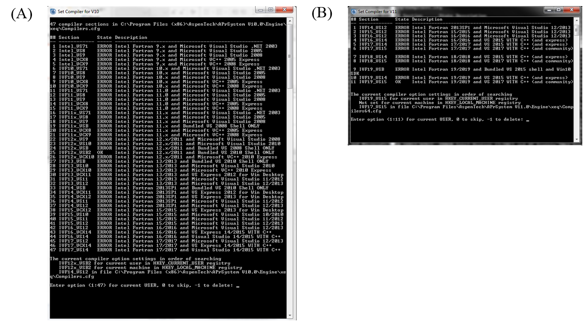

**Figure 1. 'Set Compiler' applications for (A) Aspen Plus V10 and (B) Aspen Plus V11**

As directed in the set compiler application, select an option for which the 'State' is 'OK'. the provided dll files *ccsi10.dll* and *ccsi11.dll* were compiled with the respective 
FORTRAN compilers shown with the 'OK' status in Figure 1. If all options are shown with the 'ERROR' status, then one cannot proceed with the following steps until the appropriate software
is installed.

To obtain the FORTRAN template *.f* files distributed with Aspen Tech software, navigate to one of the following folders depending on the Aspen verson of interest:

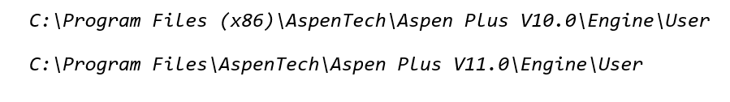

.. note::
     Templates for V10 (32-bit program) may be found in the "Program Files (x86)" directory, while those for later versions (64-bit program) are found in the "Program Files" directory.

The following subsections provide the details of the required updates to the template files.

Viscosity Model
---------------
For the liquid viscosity model, open the file *mul2u2.f*. In the section of the code titled **DECLARE ARGUMENTS**, add the following code for declaring additional variables. The existing code in 
this section of the template should not be deleted, as it is needed to declare the major input and output variables of the subroutine.

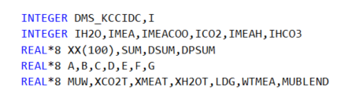

.. note:: 
   All code included in this section is available in the *SupplementalCode.f* file distributed with the model.

In the **BEGIN EXECUTABLE CODE** section, remove the template code that has been provided. Note that the final section of the template, which includes the definitions of the liquid viscosity (MUMX),
its temperature derivative (DMUMX), and its pressure derivative (DPMUMX), should not be deleted. Insert the following code under **BEGIN EXECUTABLE CODE**:

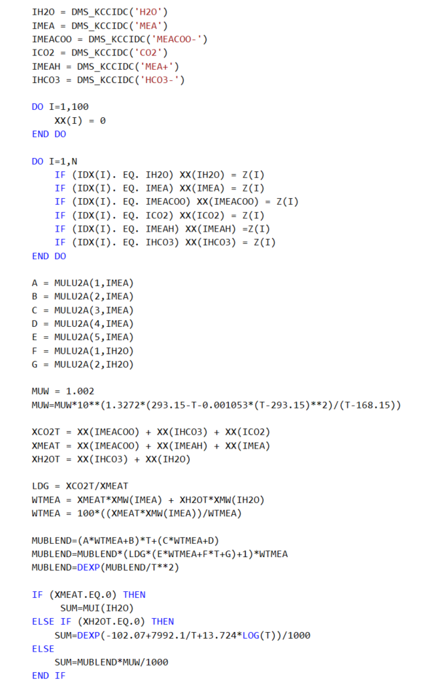

The existing **RETURN** and **END** statements at the end of the code must be retained. Ensure that the inserted code lines do not get commented.

Molar Volume Model
------------------

For the liquid molar volume model, the process is analagous to that used for the viscosity model. In the folder that contains the Fortran templates, select *vl2u2.f*. The following code should be added to the
**DECLARE ARGUMENTS** section without deleting the existing code:

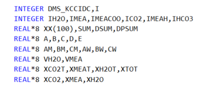

In the section marked **BEGIN EXECUTABLE CODE**, remove the template code and replace with the code given below. As with the viscosity model, avoid deleting the definitions of liquid molar volume (VMX),
its temperature derivative (DVMX), and its pressure derivative (DPVMX).

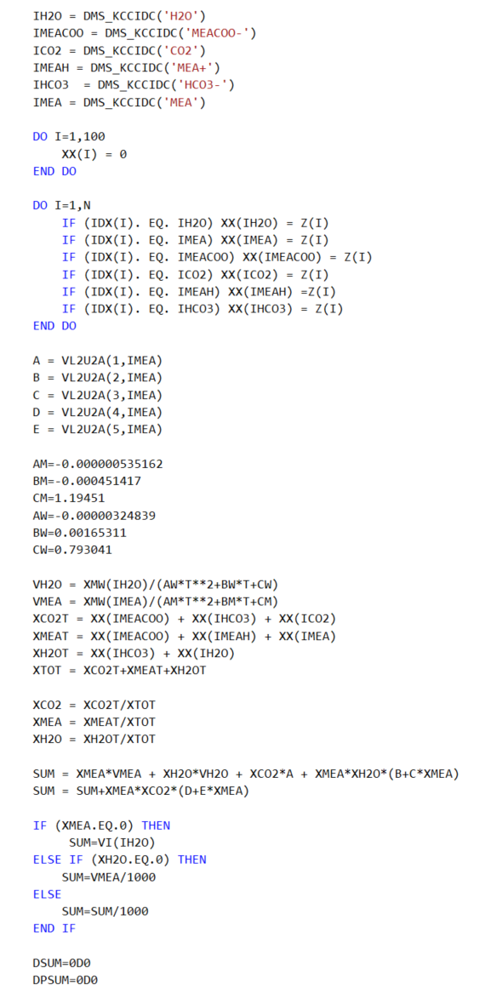

The existing **RETURN** and **END** statements at the end of the code must be retained.

Surface Tension Model
---------------------

The process for creating the surface tension model is very similar to that used for the viscosity and molar volume models. In the folder containing the Fortran templates, select *sig2u2.f*. The following
code should be added to the **DECLARE ARGUMENTS** section without deleting the existing code:

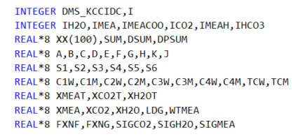

In the **BEGIN EXECUTABLE CODE** section, remove the template code and replace with the code given below. The definitions of the liquid surface tension (STMX) and its temperature and pressure 
derivatives (DSTMX and DPSTMX) should be retained.

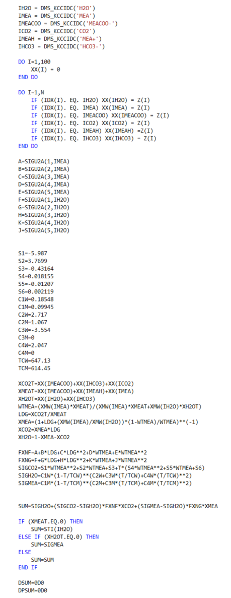

The existing **RETURN** and **END** statements at the end of the code must be retained.

Diffusivity Model
------------------

Select the template *dl0u.f* and add the following statement required for accessing component data stored in the labeled common **DMS_PLEX**, to the end of the **DECLAARE VARIABLES USED IN DIMENSIONING** section

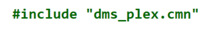

Ensure that the other *#include* statements are retained.

The following code should be added to the **DECLARE ARGUMENTS** section of the subroutine without deleting the existing code:

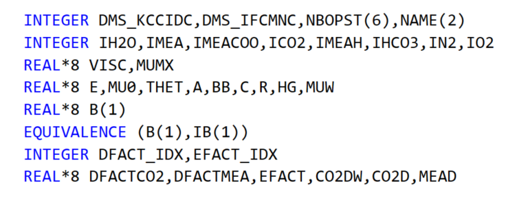

Remove all code given in the **BEGIN EXECUTABLE CODE** section, leaving only the final **END** statement. Replace this code with the following:

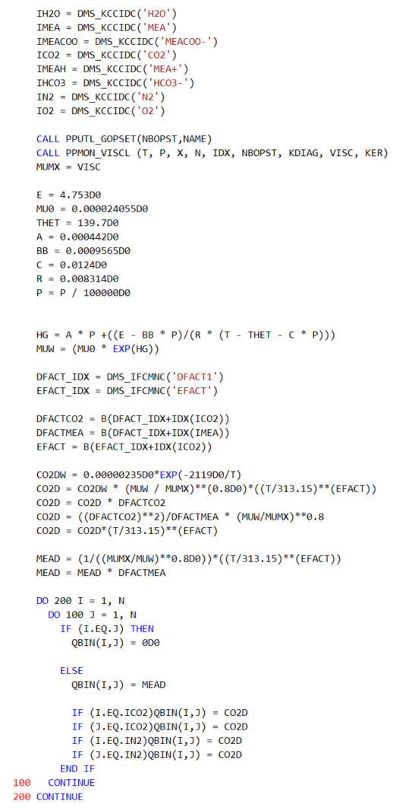

Reaction Kinetics Model
-----------------------

The template to be used for the reaction kinetics model is tiled *usrknt.f*, which is designed specifically for use with the reaction kinetics
in rate-based columns (REACT-DIST type reaction). The following code should be placed at the end of the **DECLARE VARIABLES USED IN DIMENSIONING** 
section, after the code lines

and 

:

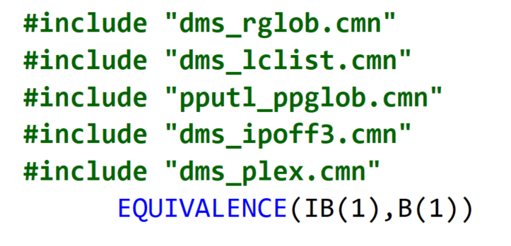

The following code should be placed in the **DECLARE ARGUMENTS** section without deleting the existing code:

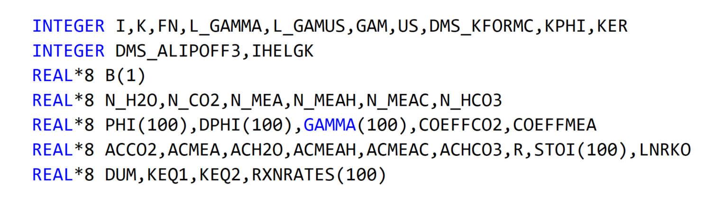

The following code should be placed in the **BEGIN EXECUTABLE CODE** section:

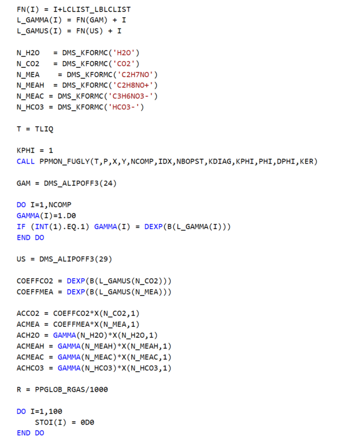
.. image:: media/Fortrancode/reaction_kinetics/Reaction_Kinetics_6.png

The existing **RETURN** and **END** statements at the end of the code must be retained.

Mass Transfer Model
--------------------

The template to be used for the mass transfer model is *usrmtrfc.f*. The following should be added to the section titled 'Declare local variables
used in the user correlations':

Here, only the code associated with mass transfer coefficients in packed columns will be replaced. This can be accomplished by deleting all code between
the lines:

and 

and replacing this code with:

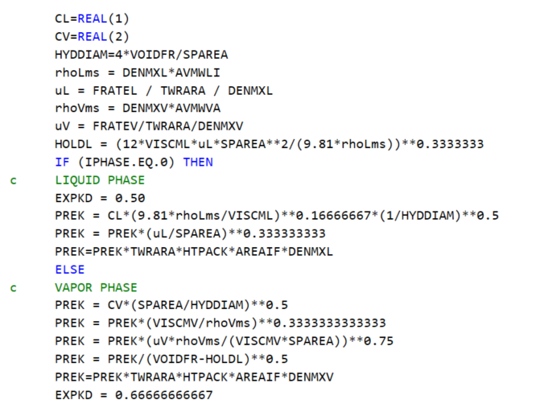

.. note::
   In earlier versions (up to and including 3.0) of the CCSI Steady State MEA model, the mass transfer coefficients were modeled using the built-in "Billet and Schultes (1993)" and the interfacial
   area (which is an input to the mass transfer coefficient calculation) with a user subroutine. However, it was determined that when modeling a rate-based column in Aspen Plus V10 with an in-built 
   mass transfer coefficient and a user subroutine for interfacial area, the user-defined interfacial area correlation is overwritten by the in-built interfacial area correlation from the same source 
   as the chosen mass transfer correlation. For this example, the interfacial area correlation associated with the selection "Billet and Schultes (1993)" was used in calculating interfacial area passed
   on to the mass transfer correlation despite the selection of "User" as the choice for interfacial area method. To fix this problem, the "User" method is used for both mass transfer coefficient and 
   interfacial area methods in the new version of the CCSI Steady State MEA Model. The code for liquid and gas-phase mass transfer coefficients in the user subroutine is based on the equations given in 
   Billet and Schultes,\ :sup:`1` \ in order to ensure consistency with the original model.

Interfacial Area Model
----------------------

The template to be used for the interfacial area model is titled *usrintfa.f*. The following code should be added to the section titled 
'Declare local variables used in the user correlations':

Remove the equations defining the variable *dTemp* and replace with the following:

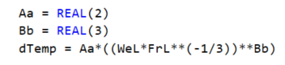

The existing **RETURN** and **END** statements at the end of the code must be retained.

Holdup Model
-------------

The template to be used for the liquid and vapor holdup in the *RateSep* routine is titled *usrhldup.f*. No additional variable names need to 
be declared. Remove the code between the statements 

and 

Insert the following replacement code:

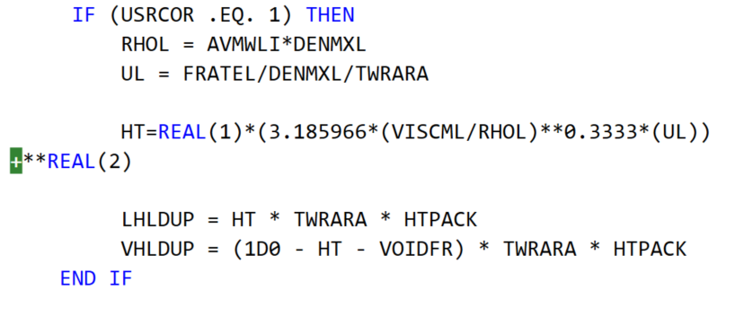

The existing **RETURN** and **END** statements at the end of the code must be retained.

Creation of *dll* and *opt* files
---------------------------------
Once the updated Fortran subroutines are ready to be implemented in the Aspen Plus model, open the *Customize Aspen Plus* utility associated with 
the Aspen Plus version of interest. Within the simulation window, navigate to the directory containing the update *.f* files. Enter the following line of code:

aspcomp *.f

This will create a separate *.obj* file for all *.f* file in the current directory. Alternatively, individual *.obj* files can be created by executing the *aspcomp*
command for each *.f* file. Once the *.obj* files are created, enter the following code to create the file *ccsi10.dll* in the current directory:

asplink ccsi10

The user may modify this command based on their preference for the dll file name.

The dll file is called within the *ccsi.opt* file distributed with the model. The opt file may be created as a text file by entering the name of the dll
file that it points to, and changing the file extension to *opt*. The opt file is specified within the Aspen model in order to access the Fortran subroutines. 
For users who choose not to create the dll file, a version is provided with the release notes in the GitHub repository.

References
----------

1. Billet, R., Schultes, M., Predicting mass transfer in packed columns. Chem Eng Technol 1993, 16, 1-9.