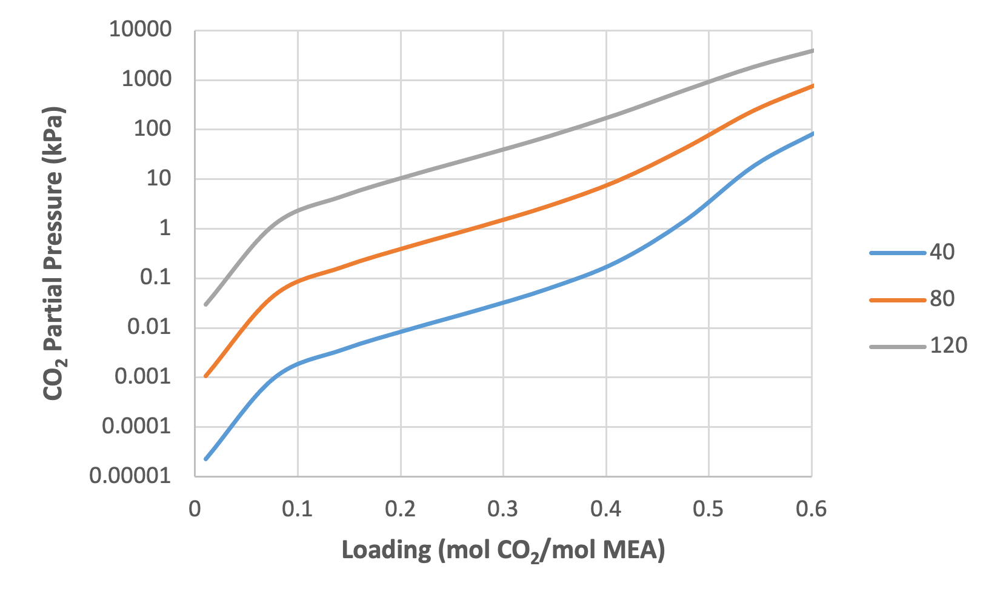
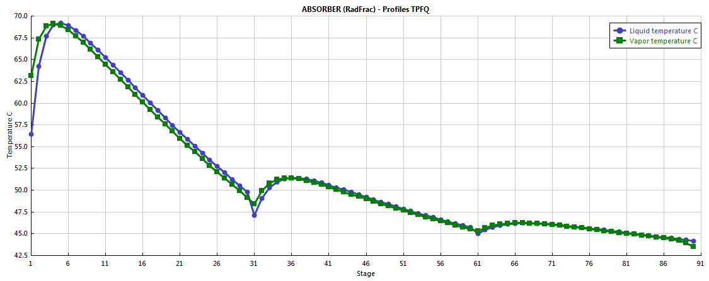
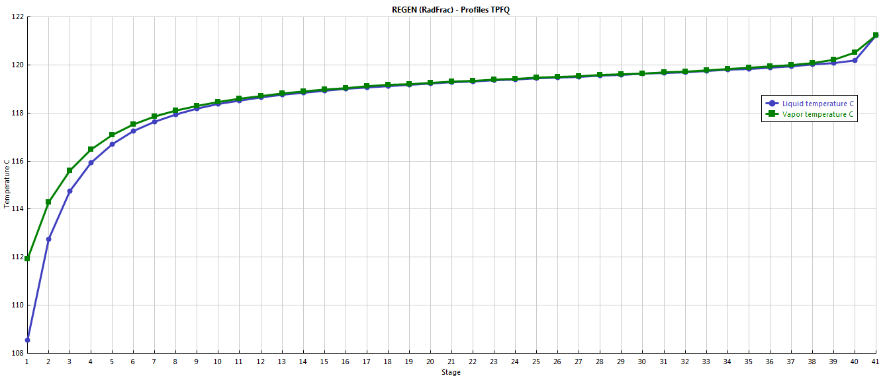

Tutorials
==========

Two tutorials are provide here to acquaint the user with the MEA process model. The first is focused on property calculations, in terms of
estimating the equilibrium partial pressure of |co2| as a function of temperature and |co2| loading. The second tutorial is focused 
on flowsheet simulation of the |co2| absorption and solvent regeneration processes.

Predicting System VLE
---------------------

#. Place the :file:`CCSI_MEAModel.bkp` file and the supporting files
   :file:`ccsi.opt` and :file:`ccsi10.dll` in the same directory. Open the
   :file:`CCSI_MEAModel.bkp` file.
   When prompted with the :guilabel:`Column Sizing/Rating Detected` box, select the :guilabel:`Use Legacy Hydraulics`
   option. If the Model Palette is not visible, it may be selected from
   the :guilabel:`View` tab at the top of the window. In the Model Palette,
   navigate to the :guilabel:`Manipulators` tab and then select :guilabel:`Mult` to create a
   multiplier block, which will be referred to by its default name :guilabel:`B1`.
   Double-click :guilabel:`B1` and then set the multiplication factor to :guilabel:`1`. Add
   an inlet stream to the block by clicking :guilabel:`Material` in the Model
   Palette, the red arrow on the inlet of :guilabel:`B1`, and then elsewhere in the
   flowsheet. Repeat the procedure for the outlet stream of :guilabel:`B1`. Name the
   inlet and outlet streams as :guilabel:`IN` and :guilabel:`OUT`, respectively.
   
   .. note::

    The streams may be renamed by double clicking the default name and
    typing the new name.

#. Double-click :guilabel:`IN` and configure it as follows:

   a. Select :guilabel:`Temperature` and :guilabel:`Vapor Fraction` as the :guilabel:`Flash Type`
      specifications.

   b. Temperature: 40°C.

   c. Vapor Fraction: 0.0001.

   d. Select :guilabel:`Mass-flow` in :guilabel:`gm/hr` as the composition basis. Set the
      values for :guilabel:`H2O` and :guilabel:`MEA` as :guilabel:`7` and :guilabel:`3`
      respectively.

1. In the left navigation pane, navigate to :menuselection:`Model Analysis Tools --> Sensitivity`
   and then click :guilabel:`New`. The new sensitivity block may be
   named “PCO2”. Under :guilabel:`Manipulated variable` in the :guilabel:`Vary` tab, select
   :guilabel:`New`, select :guilabel:`Mole Flow` as :guilabel:`type`, :guilabel:`IN` as :guilabel:`stream`, :guilabel:`CO2` as
   :guilabel:`component`, and :guilabel:`mol/hr` as the :guilabel:`units`. Under :guilabel:`Manipulated variable limits`,
   specify :guilabel:`0.0005` and :guilabel:`0.03` as the :guilabel:`lower` and :guilabel:`upper limits`, respectively, and :guilabel:`10` as the :guilabel:`number of points`.
   Navigate to the :guilabel:`Define` tab and then create a new measured variable named :guilabel:`PCO2`.
   Under :guilabel:`Edit selected variable`, select :guilabel:`Streams` as the
   :guilabel:`category`, :guilabel:`Stream-Prop` as the :guilabel:`type`, :guilabel:`IN` as the :guilabel:`stream`, and
   :guilabel:`PPCO2` as the :guilabel:`prop set`.
   Change the units to :guilabel:`kPa`.
   Navigate to the :guilabel:`Tabulate` tab and then click :guilabel:`Fill Variables`.
   Navigate to the :guilabel:`Options` tab and select the :guilabel:`Do not execute base case` option under
   :guilabel:`Execution options`.

3. Run the simulation by clicking the :guilabel:`Run` arrow or pressing :kbd:`F5`. The
   results of the :guilabel:`PCO2` sensitivity block should be consistent with
   what is shown in Table 1.

   .. note::

      All of the warnings that appear in the :guilabel:`Control Panel` while running the simulation may be ignored.

**Table 1: Results of VLE Sensitivity Block**

+------+--------+--------------+---------+
| Row/ | Status | CO2 MOLEFLOW |  PCO2   |
| Case |        |   (MOL/HR)   |  (KPA)  |
+======+========+==============+=========+
| 1    | OK     | 0.0005       | 2.24E-5 |
+------+--------+--------------+---------+
| 2    | OK     | 0.003778     | 0.00097 |
+------+--------+--------------+---------+
| 3    | OK     | 0.007056     | 0.00363 |
+------+--------+--------------+---------+
| 4    | OK     | 0.010333     | 0.00955 |
+------+--------+--------------+---------+
| 5    | OK     | 0.013611     | 0.02339 |
+------+--------+--------------+---------+
| 6    | OK     | 0.016889     | 0.06171 |
+------+--------+--------------+---------+
| 7    | OK     | 0.020167     | 0.21295 |
+------+--------+--------------+---------+
| 8    | OK     | 0.023444     | 1.47244 |
+------+--------+--------------+---------+
| 9    | OK     | 0.026722     | 18.5729 |
+------+--------+--------------+---------+
| 10   | OK     | 0.03         | 103.162 |
+------+--------+--------------+---------+

4. From this example, the vapor-liquid equilibrium (VLE) of the ternary
   MEA-H\ :sub:`2`\ O-CO\ :sub:`2` system as a function of temperature
   and CO\ :sub:`2` loading may be determined for 30 wt% MEA. The
   CO\ :sub:`2` loading (mol CO\ :sub:`2`/mol MEA) may be calculated by
   multiplying the CO\ :sub:`2` molar flow by the molecular weight of
   MEA and dividing by the mass flow of MEA. For example:

.. math::
   \frac{\mathbf{0.0005\ mol\ }\mathbf{\text{CO}}_{\mathbf{2}}}{\mathbf{\text{hr}}}\mathbf{\times}\frac{\mathbf{61.08308\ g\ MEA}}{\mathbf{\text{mol MEA}}}\mathbf{\times}\frac{\mathbf{\text{hr}}}{\mathbf{3\ g\ MEA}}\mathbf{\approx 0.0102\ mol\ }\mathbf{\text{CO}}_{\mathbf{2}}\mathbf{/mol\ MEA}

Following this procedure and evaluating the sensitivity block for temperatures of 80 and 120°C, by changing the temperature of the stream :guilabel:`IN` and re-running the simulation, a plot similar to Figure 2 may be generated.

**Figure 1: CO2 partial pressure as a function of loading and temperature (30 wt% MEA)**

|co2| Capture Process Simulation
-------------------------------------------

The base case model that is set up in the file :file:`CCSI_MEAModel.bkp` has
operating variables and equipment configurations as specified in Table
2.

**Table 2: Variables for Base Case Simulation**

=========================================== =======
Variable                                    Value
=========================================== =======
**ABSLEAN Stream (Absorber Solvent Inlet)** 
Temperature (°C)                            40.97
Pressure (kPa)                              245.94
Mass Flow (kg/hr)                           6803.7
**Component Mole Fractions**                
H\ :sub:`2`\ O                              0.87457
CO\ :sub:`2`                                0.01585
MEA                                         0.10958
**GASIN Stream (Absorber Gas Inlet)**       
Temperature (°C)                            42.48
Pressure (kPa)                              108.82
Mass Flow (kg/hr)                           2266.1
**Component Mass Fractions**                
H\ :sub:`2`\ O                              0.04623
CO\ :sub:`2`                                0.17314
N\ :sub:`2`                                 0.71165
O\ :sub:`2`                                 0.06898
**Absorber**                                
Intercooler #1 Flowrate (kg/hr)             7364.83
Intercooler #1 Return Temperature (°C)      40.13
Intercooler #2 Flowrate (kg/hr)             7421.57
Intercooler #2 Flowrate (°C)                43.32
Absorber Top Pressure (kPa)                 108.82
Absorber Packing Diameter (m)               0.64135
Absorber Packing Height (ft)                60.7184
**Regenerator**                             
Inlet Temperature (°C)                      104.81
Inlet Pressure (kPa)                        183.87
Top Pressure (kPa)                          183.7
Reboiler Duty (kW)                          430.61
Packing Diameter (in)                       23.25
Packing Height (ft)                         39.6837
=========================================== =======

The variables described in Table 3 may be varied within reason, although
abrupt changes in certain variables may results in failure of the
simulation to converge. In the simulation provided in the example file,
the variables for the :guilabel:`ABSLEAN` and :guilabel:`GASIN` streams can be located by
double-clicking the respective streams. The variables for the absorber
intercoolers can be located from the navigation pane by selecting
:menuselection:`Blocks --> ABSORBER --> Configuration --> Pumparounds`, and the first
and second intercoolers are referred to as :guilabel:`P-1` and :guilabel:`P-2`,
respectively. The top pressure of the absorber and regenerator can be
located by double-clicking the :guilabel:`ABSORBER` and :guilabel:`REGEN` blocks and
selecting the :guilabel:`Pressure` tab. Moreover, the reboiler duty for :guilabel:`REGEN` is
located under the :guilabel:`Configuration` tab. The column packing diameters and
height can be located by selecting :menuselection:`Blocks --> ABSORBER` or :menuselection:`REGEN --> Sizing and Rating --> Packing Rating --> 1 --> Setup`. The values of
the regenerator inlet pressure and temperature are specified in the
:guilabel:`PUMP` and :guilabel:`EXCHANGE` blocks, respectively. 

.. note:: 

   A sensitivity block, referred to as :guilabel:`FLOW` in the simulation, is used to set the
   flowrate of the inlet solvent stream, as the simulation will not
   automatically converge for such a low flow rate.

Next, the CO\ :sub:`2` capture process, which includes the
absorber and regenerator columns, is evaluated for two sets of operating
conditions.

1. Open the :file:`CCSI_MEAModel.bkp` file. In the navigation pane,
   right-click :guilabel:`Blocks`, select :guilabel:`Activate`, right-click :guilabel:`Streams`, and
   then select :guilabel:`Activate`. Run the simulation.
   
   .. note::

      All streams and blocks have been deactivated to reduce the time required to obtain the results for the test in Section 2.2 Predicting System VLE.
      If block :guilabel:`B1` and streams :guilabel:`IN` and :guilabel:`OUT` have already been created in the same file,
      they need to be deactivated by right-clicking them and selecting :guilabel:`Deactivate` before activating all streams with the aforementioned procedure.

5. In the flowsheet, right-click stream :guilabel:`ABSRICH`, select :guilabel:`Results`, and
   then select :guilabel:`STRIPOUT` from the drop-down arrow at the top of the
   right column. Ensure that the results obtained match those given in
   Table 3, noting that only selected rows are included in the table.
   The results shown in Table 3 were obtained from Aspen V10, and may
   vary slightly when using Aspen V11.

**Table 3: Selected Stream Table Results**

================ ========== ==========
Mole Flow mol/hr ABSRICH    STRIPOUT
================ ========== ==========
H2O              260007     256376
CO2              0.344276   0.976410
MEA              8684.95    26272.89
MEA+             12184.17   3270.263
MEACOO-          11833.81   3152.68
HCO3-            350.36     117.58
N2               33.17      2.14E-16
O2               5.55       5.47E-18
Temperature C    52.01      120.94
Pressure kPa     108.82     183.7
Enthalpy J/kmol  -301829043 -281379385
================ ========== ==========

6. Reinitialize the simulation by clicking :guilabel:`Reset` or pressing
   :kbd:`Shift+F5`, and then selecting :guilabel:`OK`. In the navigation pane, navigate
   to :menuselection:`Blocks --> Absorber --> Configuration --> Pumparounds --> P-1`,
   and then change the :guilabel:`flow rate` to :guilabel:`3000 kg/hr`. Navigate to :guilabel:`P-2`
   and then change the :guilabel:`flow rate` to the same value.

7. Navigate to :guilabel:`Model Analysis Tools` and activate the :guilabel:`FLOW`
   sensitivity block, which is used to determine the CO\ :sub:`2`
   capture percentage in the absorber and the required reboiler duty for
   the stripper as a function of the lean solvent flowrate. Execute the
   model, navigate to the results of the sensitivity block, and verify
   that the results are similar to those shown in Figure 3; note that
   these results were generated using Aspen V10 and may be slightly
   different when running the model with Aspen V11.

.. image:: media/flow_results.png
**Figure 2: Results of the :guilabel:`FLOW` sensitivity block for the case study.**

8. Navigate to :menuselection:`Blocks --> Absorber --> Profiles` and then highlight the
   columns labeled :guilabel:`Vapor Temperature` and :guilabel:`Liquid Temperature`. Under
   :guilabel:`Plot` on the :guilabel:`Home` tab, select :guilabel:`Custom`, and then verify that the
   resulting plot resembles Figure 4.
   
   .. note::
   
      These temperature profiles correspond to the last simulation executed (Case 8).

**Figure 3: Absorber temperature profile for the case study.**

9. Navigate to :menuselection:`Blocks --> Regen --> Profiles` and then repeat the
   procedure described in Step 5. Verify that the temperature profile
   resembles what is shown in Figure 4.

**Figure 4: Regenerator temperature profile for the case study.**